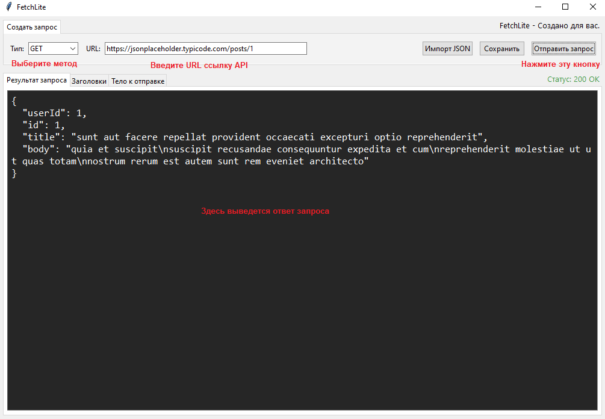
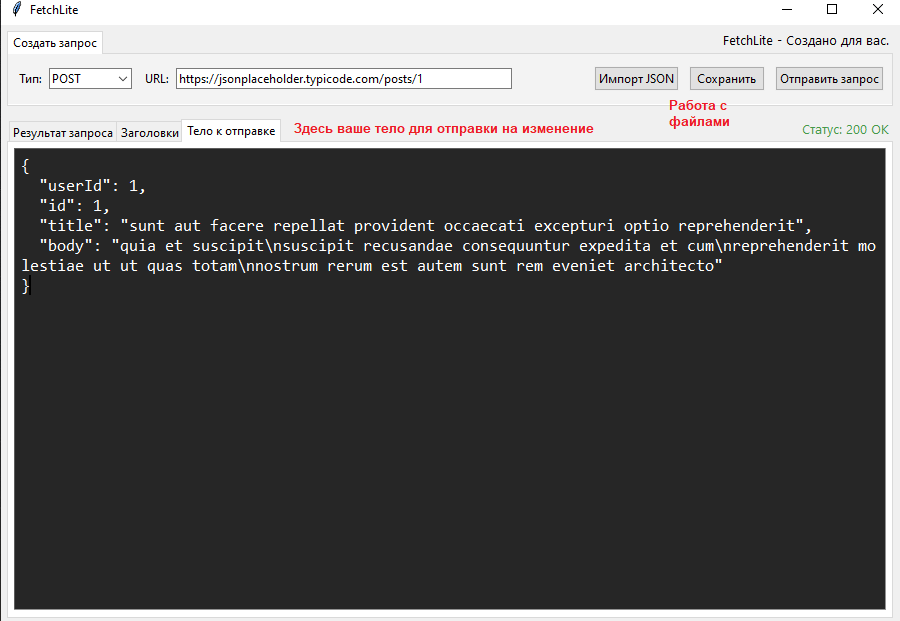

# FetchLite

**Современный, легковесный API клиент с чистым и интуитивным интерфейсом.**

FetchLite — это мощный инструмент для HTTP запросов, написанный на Python с использованием Tkinter. Он создан для разработчиков, которым нужен быстрый и надежный способ тестирования и отладки REST API. FetchLite сочетает простоту использования с профессиональными возможностями.

## Возможности

| Возможность | Описание |
|------|----------|
| 🚀 **Множество HTTP методов** | GET, POST, PUT, PATCH, DELETE |
| 📋 **Пользовательские заголовки** | Добавляйте любые заголовки в удобном текстовом формате |
| 📦 **Тело запроса** | Отправляйте JSON, form data или любой другой текст |
| 🎨 **Современный интерфейс** | Чистый минималистичный дизайн |
| ⚡ **Быстрые запросы** | Мгновенное выполнение с таймаутом 5 секунд |
| 🔍 **Просмотр ответов** | Удобное отображение ответов сервера |
| 🌙 **Темная тема** | Встроена по умолчанию, не напрягает глаза |
| 🍃 **Легковесность** | Минимум зависимостей, быстрый запуск |
| 📊 **Вкладки** | Удобная организация рабочего пространства |


## Системные требования

| Требование | Минимальные | Рекомендуемые |
|------------|-------------|---------------|
| **ОЗУ** | 64 MB | 128 MB |
| **Место на диске** | 12 MB | 25 MB |
| **Python** | 3.8+ (уже установлен) | 3.10+ |

## Установка

### Шаги установки

1. Клонируйте репозиторий:
```bash
git clone https://github.com/ExityxXx/FetchLite.git
cd fetchlite
```

2. Установите зависимости:
```bash
pip install -r requirements.txt
```

3. Запустите приложение:
```bash
python app.py
```

## Использование
### Отправка GET запроса
* **Выберите метод GET в выпадающем списке**

* **Введите URL API в поле адреса**

* **Нажмите кнопку "Отправить запрос"**

---



## Отправка POST/PUT/PATCH запроса
* **Выберите соответствующий метод**

* **Введите URL**

* **Перейдите на вкладку "Заголовки" и добавьте Content-Type (например: Content-Type: application/json)**
    Но по умолчанию заголовок уже установлен

* **Перейдите на вкладку "Тело к отправке" и введите данные**

* **Нажмите "Отправить запрос"**

---


